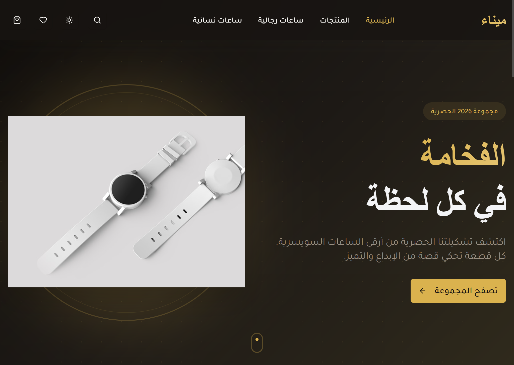

# Dial Watch Store ⌚

A premium, modern e-commerce platform for luxury watches, built with performance and aesthetics in mind.



## ✨ Features

- 💎 **Premium UI/UX**: Modern design with glassmorphism and smooth animations.
- 📱 **Fully Responsive**: Optimized for all screen sizes, from mobile to desktop.
- 🛍️ **Cart Management**: Add, remove, and update quantities seamlessly.
- ❤️ **Wishlist**: Save your favorite pieces for later.
- 🌖 **Dark/Light Mode**: Elegant theme switching using `next-themes`.
- 🔍 **Filtering & Search**: Easily find watches by brand, category, or gender.
- 🌍 **RTL Support**: Built with Arabic language and RTL layout natively.

## 🛠️ Tech Stack

- **Frontend**: React 19 + Vite
- **Styling**: Tailwind CSS v4
- **State Management**: Redux Toolkit
- **Animations**: Motion (Framer Motion)
- **Routing**: React Router v7
- **Feedback**: Sonner (Customized for premium look)
- **Icons**: Lucide React

## 📂 Project Structure

```text
src/
├── components/   # Reusable UI elements (Cart, Layout, Products)
├── pages/        # Main application views (Home, Products, Details)
├── store/        # Redux slices and configuration
├── data/         # Product and static content data
├── utils/        # Helper functions (Formatting, etc.)
└── index.css     # Global styles and design tokens
```

## 🚀 Getting Started

### Prerequisites

- Node.js (Latest LTS recommended)
- npm or yarn

### Installation

1. Clone the repository
2. Install dependencies:
   ```bash
   npm install
   ```
3. Run the development server:
   ```bash
   npm run dev
   ```
4. Build for production:
   ```bash
   npm run build
   ```
